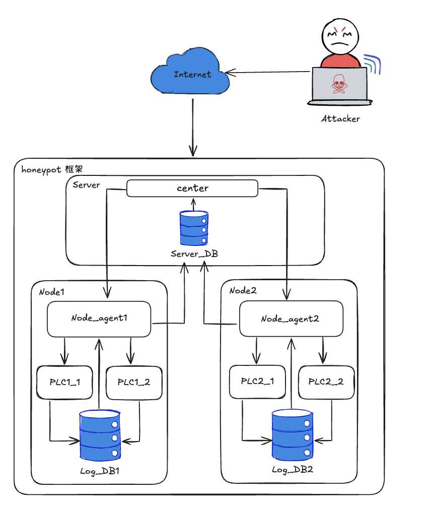

# ICS Honeypot Project

An Industrial Control Systems honeypot platform with a central server, distributed client agents, Docker-managed honeypot packages, and optional ELK ingestion.

## Architecture

- **Server**: FastAPI control plane for agent registration, package configuration, log intake, and dashboard views.
- **Client Agent**: Pulls config from the server, writes honeypot package files to disk, runs `docker compose`, collects local logs, and forwards them upstream.
- **Honeypot Packages**: Each deployment is a folder of files such as `Dockerfile`, `docker-compose.yml`, source code, and service configs.
- **ELK Stack**: Optional Filebeat/Elasticsearch/Kibana pipeline that tails the server-side JSON logs.



## Package Spec

Each client config contains a `deployments` array. Every deployment is a self-contained package.

```json
{
    "node_id": "node_01",
    "server_url": "http://localhost:8000",
    "deployments": [
        {
            "id": "http-gateway",
            "name": "HTTP Gateway Honeypot",
            "type": "http",
            "template": "http",
            "enabled": true,
            "source_dir": "http-gateway",
            "log_paths": ["logs/access.jsonl"],
            "files": [
                {
                    "path": "Dockerfile",
                    "content": "FROM nginx:1.27-alpine\nCOPY nginx.conf /etc/nginx/nginx.conf\nCOPY site /usr/share/nginx/html\n"
                },
                {
                    "path": "docker-compose.yml",
                    "content": "services:\n  honeypot:\n    build: .\n    restart: unless-stopped\n"
                }
            ]
        }
    ]
}
```

## How It Works

1. You edit a honeypot package in the server UI.
2. The server stores the package in the agent config.
3. On first deploy, the client seeds the package under `client/runtime/<node>/<deployment>/package/<source_dir>/`.
4. After that, the client-local package is authoritative: local file edits are preserved and server file updates do not overwrite them.
5. The client also prepares dedicated folders for each honeypot under:
    - `client/runtime/<node>/<deployment>/data/`
    - `client/runtime/<node>/<deployment>/logs/`
6. The client runs `docker compose up -d --build` inside the package folder.
7. The client tails the configured `log_paths` and uploads entries to the server.

## Available Templates

- `modbus`: simple Modbus TCP honeypot package
- `http`: static HTTP decoy package using Nginx
- `mqtt`: Mosquitto-based MQTT package

Template defaults live in `server/deployment_templates/` and are used as quick-start packages in the UI.

## Project Structure

- `client/`
  - `agent.py`: server sync loop, package orchestration, log upload
  - `docker_manager.py`: writes package files and controls `docker compose`
  - `log_collector.py`: tails package log files into the local SQLite buffer
  - `client_config.json`: local example config
- `server/`
  - `main.py`: API and web dashboard
  - `database.py`: agent/log persistence
  - `deployment_templates/`: starter packages for Modbus, HTTP, and MQTT
  - `elk/`: ELK stack compose files

## Prerequisites

- Python 3.8+
- Docker with `docker compose`

## Installation

Use a virtual environment, then install dependencies:

```bash
python3 -m venv venv
source venv/bin/activate
python3 -m pip install -r requirements.txt
```

## Usage

### 1. Start the server

```bash
./server/start_services.sh
```

- Server UI: <http://127.0.0.1:8000>
- Kibana: <http://localhost:5601>

### 2. Start the client agent

```bash
source venv/bin/activate
python3 client/main.py
```

### 3. Configure honeypot packages from the UI

Open the server UI, edit an agent, add a package template, then customize:

- `Dockerfile`
- `docker-compose.yml`
- extra files such as `app.py`, `nginx.conf`, `mosquitto.conf`, or HTML pages
- relative `log_paths` that the client should tail
- or upload a `.zip` source archive; the server extracts it and the config page shows each file in the editor tree
- uploaded zip archives are also saved into the server-side package library, so later agents can browse and reuse them

## Logging Flow

- Server-delivered files are written under `client/runtime/<node-id>/<deployment-id>/package/<source_dir>/`
- Each honeypot has its own runtime data folder at `client/runtime/<node-id>/<deployment-id>/data/`
- Each honeypot has its own log folder at `client/runtime/<node-id>/<deployment-id>/logs/`
- Relative `log_paths` starting with `logs/` are resolved into that honeypot log folder
- Relative `log_paths` starting with `data/` are resolved into that honeypot data folder
- The client agent reads new log lines and stores them in `client/client_logs.db`
- The server receives uploaded logs and stores them in `server/server.db`
- The server also writes JSON log files under `server/logs/` for Filebeat

## Notes

- The server UI now edits raw package files instead of fixed protocol-specific form fields.
- The client does not auto-create a `docker-compose.yml` for you.
- `docker-compose.yml` should be part of the package if you want compose mode.
- If both `docker-compose.yml` and `Dockerfile` exist, the client uses `docker-compose.yml` first.
- If only `Dockerfile` exists, the client falls back to `docker build` + `docker run` automatically.
- `docker-compose.yml` can mount `${HONEYPOT_DATA_DIR}` and `${HONEYPOT_LOGS_DIR}` to keep each honeypot isolated.
- Client-local package files are the source of truth after initial deployment; edit the files under `client/runtime/.../package/...` if you want client-side changes to persist.
- The client generates a compose override with unique container names, so reused packages do not collide on names like `mqtt-honeypot`.
- When the client process exits normally, receives `SIGINT`, or receives `SIGTERM`, it stops all honeypot containers it started.
- The client sends the full package config to the server only when it changes; regular heartbeats stay lightweight so large honeypot packages do not make the agent look offline.

## License

[MIT License](LICENSE)
